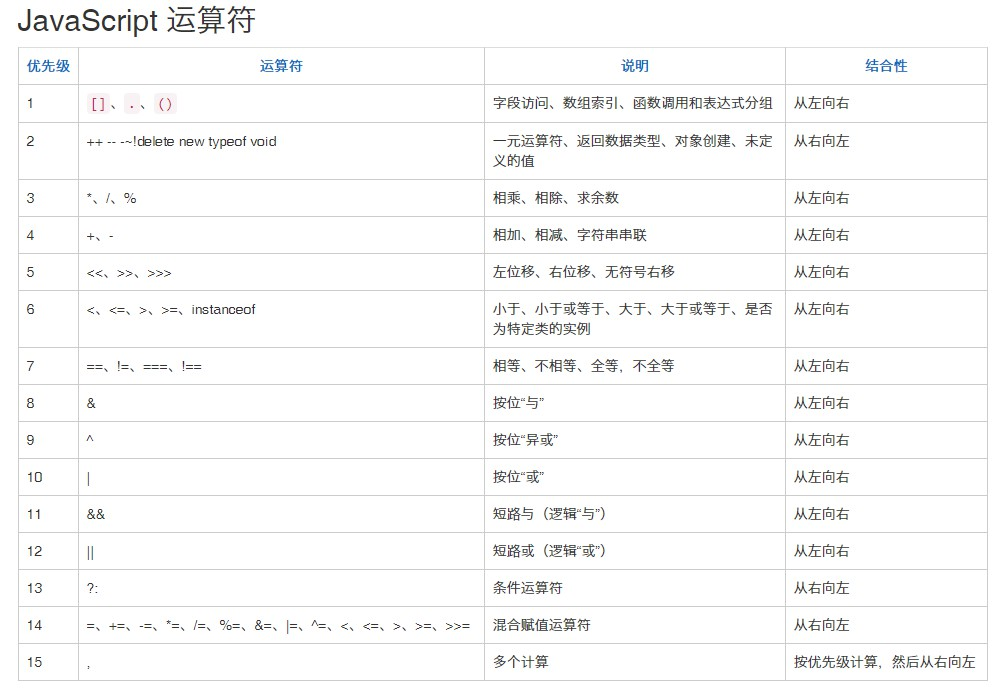

# js知识点
## HTML 中的 JavaScript
1. 在xml利用script标签引入js文件时可以忽略结束标签，但是在html中不行。
2. script标签可以向目标路径发送get请求，初始发送时不遵守同源策略，但是返回的js文件会受到限制。(待补充)
3.  script标签的defer属性代表等待所有渲染完成后才执行，async代表只要资源下载完就会执行其内部代码，两者都会异步下载js文件，不会阻碍渲染引擎。
4. noscript标签可以在浏览器不支持脚本和关闭脚本支持时执行。
## 语言基础

### var
- 不在函数内使用var定义的变量会自动变成全局变量。
- 会进行变量提升，即使是return语句后面的声明。
- 同一变量再次使用var定义会自动取消var的声明过程，不过赋值语句同样有效。
- 函数提升在var变量提升之前

### let和const关键字
let和const是块级作用域，即在()和{}内部定义的变量不能在其外部访问，但是var是函数作用域，只要在同一个函数内就可以被访问。
在全局作用域下使用var定义会将变量变为window的属性，但是let和const不会。
###  for in 
可以遍历数组，但是不保证遍历时的顺序是依次的，并且会将原型上的属性也遍历，可以正常执行break和continue，但是得到的索引为字符串数字，通常遍历对象。
```js
Array.prototype.name = 'world';
let myArray = [1, 2, 10, 30, 100];
myArray.type='数组';
for(let index in myArray){
    console.log(index);
}
output:
0
1
2
3
4
type
name
```
### for of
1. 可以使用的范围包括数组、Set 和 Map 结构、某些类似数组的对象（比如arguments对象、DOM NodeList 对象）、Generator 对象，以及字符串，但是不能遍历对象，因为没有迭代器对象。
2. 能够正常执行 break、continue和return。
3. 得到的索引是键值对的值。通常遍历数组。
```js
 // 字符串
  var str = "hello";
  for (let s of str) {
    console.log(s); // h e l l o
  }  
// DOM NodeList对象
  let paras = document.querySelectorAll("p");
  for (let p of paras) {
   p.classList.add("test");
  }  
// arguments对象
  function Args() {
    for (let x of arguments) {
      console.log(x);
    }
  }
Args('a', 'b');// 'a' 'b'
```
### undefined类型
已声明但未初始化的值为undefined，不显式的将变量设为undefined，未声明的变量只能执行typeof这个操作，其它操作会抛出异常，
### null类型
一个空对象指针，所以typeof null 会返回 ’object‘。null == undefined 的结果为true
### boolean类型
转换为false的值有，0，''，null，undefined，NaN
### number类型
#### 进制字面量
八进制的字面量需要以0开头，如果出现大于8的数字会忽略首0，当成十进制处理。在严格模式下使用0开头表示八进制会报错，需要用0o前缀表示八进制；十六进制使用0x前缀。
```js
let num1 = 071 // 表示57
let num2 = 087 // 无效八进制， 表示87
let num3 = 0x1f // 十六进制 31
```
#### 科学计数法
```js
let num3 = 3e5 // 表示300000
let num4 = 3e-5 // 表示0.00003
```
#### 最值
最大值为MAX_VALUE = 1.7976931348623157e308为2的53次方，最小值为MIN_VALUE=5e-324为2的负53次方，接近零但大于0。
#### NaN
NaN表示本来是要返回数字的操作失败了，不是抛出错误，NaN和任何值操作都返回NaN，NaN不等于包括NaN在内的任何值。
#### 数值比较
将其它值转换为数字的方法有三个，Number()、parseInt()和 parseFloat()。Number()是转型函数，可用于任何数据，后两个函数主要用于字符串，转换实例。
```js
Number(true) // 1
Number(false) // 0
Number(null) // 0
Number(undefined) NaN
Number('') // 0 parseInt 对空字符串转换会返回NaN
Number('526') // 526
Number('fdsg') // NaN
// 转换对象时，先调用valueOf方法，如果返回NaN则继续调用toString方法，最后根据字符串转换成数字的规则进行返回。== 进行的隐式转换也遵循该规则。
Number({}) // NaN 
Number([]) // 0
let num1 = parseInt("1234blue"); // 1234
let num2 = parseInt(""); // NaN
let num3 = parseInt("0xA"); // 10，解释为十六进制整数
let num4 = parseInt(22.5); // 22
let num5 = parseInt("70"); // 70，解释为十进制值
let num6 = parseInt("0xf"); // 15，解释为十六进制整数

//事实上，如果提供了十六进制参数，那么字符串前面的"0x"可以省掉：
let num1 = parseInt("AF", 16); // 175
let num2 = parseInt("AF"); // NaN 

let num1 = parseInt("10", 2); // 2，按二进制解析
let num2 = parseInt("10", 8); // 8，按八进制解析
let num3 = parseInt("10", 10); // 10，按十进制解析
let num4 = parseInt("10", 16); // 16，按十六进制解析

let num1 = parseFloat("1234blue"); // 1234，按整数解析
let num2 = parseFloat("0xA"); // 0
let num3 = parseFloat("22.5"); // 22.5
let num4 = parseFloat("22.34.5"); // 22.34
let num5 = parseFloat("0908.5"); // 908.5
let num6 = parseFloat("3.125e7"); // 31250000 
```
### string类型
#### 转换为字符串
有两种方法将一个值转换为字符串，第一个是值对应的toString方法，但是null和undefined没有toString方法
```js
let age = 11;
let ageAsString = age.toString(); // 字符串"11"
let found = true;
let foundAsString = found.toString(); // 字符串"true" 
```
第二个是使用String方法，该方法覆盖了null和undefined，
```js
let value1 = 10;
let value2 = true;
let value3 = null;
let value4;
console.log(String(value1)); // "10"
console.log(String(value2)); // "true"
console.log(String(value3)); // "null"
console.log(String(value4)); // "undefined" 
```
#### 模板字符串
模板字符串保留换行字符，在写html结构字符串时很有用，
```js
let pageHTML = `
<div>
 <a href="#">
 <span>Jake</span>
 </a>
</div>`; 
// 插入的值会调用toString方法
let foo = { toString: () => 'World' };
console.log(`Hello, ${ foo }!`); // Hello, World! 
```
模板字面量标签函数：
```js
let a = 6;
let b = 9;
function simpleTag(strings, aValExpression, bValExpression, sumExpression) {
 console.log(strings);
 console.log(aValExpression);
 console.log(bValExpression);
 console.log(sumExpression);
 return 'foobar';
}
let untaggedResult = `${ a } + ${ b } = ${ a + b }`;
let taggedResult = simpleTag`${ a } + ${ b } = ${ a + b }`;
// ["", " + ", " = ", ""] // 以${}为间隔，取其间隔间的字符，包括开头和结尾。
// 6
// 9
// 15
console.log(untaggedResult); // "6 + 9 = 15"
console.log(taggedResult); // "foobar" 

let a = 6;
let b = 9;
function zipTag(strings, ...expressions) {
 return strings[0] +
 expressions.map((e, i) => `${e}${strings[i + 1]}`)
 .join('');
}
let untaggedResult = `${ a } + ${ b } = ${ a + b }`;
let taggedResult = zipTag`${ a } + ${ b } = ${ a + b }`;
console.log(untaggedResult); // "6 + 9 = 15"
console.log(taggedResult); // "6 + 9 = 15" 
```
原始字符串
使用String.raw标签函数可以得到原始的字符串，包括换行符和Unicode编码等
```js
// Unicode 示例
// \u00A9 是版权符号
console.log(`\u00A9`); // ©
console.log(String.raw`\u00A9`); // \u00A9
// 换行符示例
console.log(`first line\nsecond line`);
// first line
// second line
console.log(String.raw`first line\nsecond line`); // "first line\nsecond line"
```
### Symbol 类型
 symbol为了创建唯一记号的，通常用作对象的唯一属性，需要用Symbol函数进行初始化，不能和new关键字一起当作构造函数使用，没有字面量语法。
```js
 let sym = Symbol();
console.log(typeof sym); // symbol
// 可以传入一个字符串参数作为符号的描述，传入相同的描述不会生成一样的符号
let fooSymbol = Symbol('foo');
let otherFooSymbol = Symbol('foo');
console.log(genericSymbol == otherGenericSymbol); // false 
// Symbol和new关键字一起使用会抛出异常。
let myBoolean = new Boolean();
console.log(typeof myBoolean); // "object"
let myString = new String();
console.log(typeof myString); // "object"
let myNumber = new Number();
console.log(typeof myNumber); // "object"
let mySymbol = new Symbol(); // TypeError: Symbol is not a constructor 
// 如果需要将符号包装对象可以利用Object函数
let mySymbol = Symbol();
let myWrappedSymbol = Object(mySymbol);
console.log(typeof myWrappedSymbol); // "object" 
```
 symbol创建普通符号，symbol.for创建全局符号，并且必须传入字符串键描述,全局符号可以复用。
```js
let fooGlobalSymbol = Symbol.for('foo'); // 创建新符号
let otherFooGlobalSymbol = Symbol.for('foo'); // 重用已有符号
console.log(fooGlobalSymbol === otherFooGlobalSymbol); // true 
// 全局符号和普通符号即使使用相同的描述也是不一样的符号
let localSymbol = Symbol('foo');
let globalSymbol = Symbol.for('foo');
console.log(localSymbol === globalSymbol); // false 
// 可以使用Symbol.keyFor查询符号的字符串键。
// 创建全局符号
let s = Symbol.for('foo');
console.log(Symbol.keyFor(s)); // foo 
```
凡是可以使用字符串或数值作为属性的地方，都可以使用符号。这就包括了对象字面量属性和
Object.defineProperty()/Object.defineProperties()定义的属性。
```js
let s1 = Symbol('foo'),
 s2 = Symbol('bar'),
 s3 = Symbol('baz'),
 s4 = Symbol('qux');
let o = {
 [s1]: 'foo val'
};
// 这样也可以：o[s1] = 'foo val';
console.log(o);
// {Symbol(foo): foo val}
Object.defineProperty(o, s2, {value: 'bar val'});
console.log(o);
// {Symbol(foo): foo val, Symbol(bar): bar val}
Object.defineProperties(o, {
 [s3]: {value: 'baz val'},
 [s4]: {value: 'qux val'}
});
console.log(o);
// {Symbol(foo): foo val, Symbol(bar): bar val,
// Symbol(baz): baz val, Symbol(qux): qux val} 
```
类似于 Object.getOwnPropertyNames()返回对象实例的常规属性数组，Object.getOwnPropertySymbols()返回对象实例的符号属性数组。这两个方法的返回值彼此互斥。Object.getOwnPropertyDescriptors()会返回同时包含常规和符号属性描述符的对象。Reflect.ownKeys()会返回两种类型.
如果将符号设置为对象属性时，未进行显示保存，那么获取该属性键需要遍历得到。
```js
let o = {
 [Symbol('foo')]: 'foo val',
 [Symbol('bar')]: 'bar val'
};
console.log(o);
// {Symbol(foo): "foo val", Symbol(bar): "bar val"}
let barSymbol = Object.getOwnPropertySymbols(o)
 .find((symbol) => symbol.toString().match(/bar/));
console.log(barSymbol);
// Symbol(bar)
```
## 原型链

### 实例判断
instanceof判断的右边原型是否再左边对象原型链上，左边的值需要是对象才有效，如果左边时基础数据类型则回返回false。
下面是模拟instanceof，不过下面的方法基础数据类型也可以进行判断。
```js
function checkIfInstanceOf(obj, classFunction) {
  if(obj === null || classFunction === null || obj === undefined || classFunction === undefined) {
     return false;
  }
  let obj_proto = obj._proto_
   // 一个对象的__proto__指向其构造函数的prototype，由于本体的构造函数可以继承，故需要循环来判断
   while(obj_proto !== null) {
         if(obj_proto  === classFunction.prototype) {
            return true;
         } else {
            obj_proto = obj_proto.__proto__;
         }
   }
  return false;
};
```
## Api
### 字符串
#### charCodeAt
返回字符的ASC||编码，如果要查看数字的编码需要将其转为字符串才能调用改方法，会默认返回第一个字符的编码，可以字符串下标索引，可以返回对应索引字符的编码，空字符会返回NaN。
```js
"1f3".charCodeAt() // 49
"1f3".charCodeAt(1) // 102
"1f3".charCodeAt(3) // NaN
```
## 进制
### 进制种类
#### 十进制
正常输入的为十进制。
#### 八进制
使用0o或0O开头
```js
0o33 // 27
```
#### 十六进制
```js
0x13 // 19
```
#### 二进制
```js
0b11 // 3
```
### 进制转换
使用parseInt将字符串或数字以对应的进制(2-36)进行解析
```js
parseInt('z',36) // 35第二个参数默认传10，无法转换返回NaN
```
使用Number将字符串转换为十进制数字，需要带前缀
```js
Number('0b11100') // 28
Number('0o33') // 27
Number('0x33') //51
Number('0x88kk') // NaN
```
使用+(一元运算符)转换成十进制，实际和Number一样
```js
+'0b11100' // 28
+'0o33' // 27
+'0x33' //51
+'0x88kk' // Na
```
使用Number.prototype.toString可以将数字转换成对应的进制(2-36)，支持小数，默认转成十进制 。
```js
15..toString(2) // 1111
585..toString(8) // 1111
4369..toString(16) // 1111
(11.25).toString(2) // 1011.01
```
## 函数调用指定this
下面三种指定this的方法实际上都不会真的往我们指定的对象上增加我们需要调用的函数。
### call
接受多个参数，第一个是指定的this，第二个开始依次为函数的参数
```js
window.number = 'one'
var s1 = {number: 'three' };
function changeColor(){
    console.log(this.number);
}
changeColor.call() // 'one' 严格模式下，不会默认传window，即不传时为undefined
changeColor.call(s1) // three
```
模拟call
```js
Function.prototype.myCall = function (context) {
   let obj = context || window
   obj.fn = this
   let args = []
   for (let i = 1, len = arguments.length; i < len; i++) {
       args.push(arguments[i])
   }
   const result = obj.fn(...args)
   return result
}
// test
function add(c, d) {
    return this.a + this.b + c + d;
}
const obj = { a: 1, b: 2 };
console.log(add.myCall(obj, 3, 4)); // 10  
console.log(add.myCall({ a: 3, b: 9 }, 3, 4)); // 19
console.log(add.myCall({ a: 3, b: 9 }, { xx: 1 }, 4)); // 12[object Object]4 
```
### apply
接受两个参数，第一个参数为指定的this，第二个为函数本身参数的的参数数组。
```js
window.number = 'one'
var s1 = {number: 'three' };
function changeColor(){
    console.log(this.number);
}
changeColor.apply() // 'one' 严格模式下，不会默认传window，即不传时为undefined
changeColor.apply(s1) // three
```
模拟实现apply
```js
Function.prototype.myApply = function (object, arr) {
    let obj = object || window
    obj.fn = this
    let result
    if (!arr) {
        return obj.fn()
    }
    if (!(arr instanceof Array)) {
        throw new Error('params must be array')
    }
    result = obj.fn(...arr)
    delete obj.fn
    return result
}
// test
function add(c, d) {
    return this.a + this.b + c + d;
}
const obj = { a: 1, b: 2 };
console.log(add.myApply(obj)); // NaN
console.log(add.myApply(obj, [3, 4])); // 10 
console.log(add.myApply(obj, [1, 'abc', '2'])); // 4abc
```
### bind
该方法指定函数调用的this，但不会马上执行函数，而是会返回一个新函数，利用闭包的特性将指定this调用函数的状态保存下来，方便调用。
模拟实现bind
```js
Function.prototype.my_bind = function(context){
    var args = Array.prototype.slice.call(arguments, 1);
    //args [7, 8]
    var self = this;
    return function(){
        var innerArgs = Array.prototype.slice.call(arguments);
        //innerArgs [9]
        var finalArgs = args.concat(innerArgs);
        //finalArgs [7, 8, 9]
        return self.apply(context, finalArgs);
    }
}
```
## 阻止默认行为
```js
event.preventDefault()
```
## 阻止事件传播
```js
event.stopPropagation()
```
可以通过addEventListener的第三个参数修改事件触发的阶段，为true时，事件在捕获阶段触发，反之则在冒泡阶段触发。在冒泡阶段阻止事件传播会阻止元素祖先元素的事件触发，而在捕获阶段会阻止后代元素的事件触发。想让元素的后代元素的某个事件失效，需要在绑定事件时将事件改为捕获阶段触发，并阻止事件传播。
## 不冒泡事件
有些事件不冒泡，如果需要此事件冒泡需要找到可冒泡的替代事件，例如onblur和onfocus不冒泡，可以使用focusin和focusout事件。不冒泡事件有如下：
- blur
- focus
- mouseenter
- mouseleave
所以焦点事件也可以做事件委派，可以给任意祖先元素绑定焦点事件。
react可以直接通过祖先元素委派focus等不能冒泡的事件，因为react默认将事件都委派在顶层元素(待研究)。
## 事件函数执行顺序
事件函数是按类别执行的，如果一个元素同时被触发了多种事件，那么这些事件会依次执行(执行顺序待研究)，当一种事件执行时，会先冒泡执行祖先元素的相同事件，当祖先元素的这一事件被执行完毕后，才会继续触发其它种类事件，即使事件执行过程中有宏任务或微任务。

同一类型的事件在冒泡执行过程中有宏任务会被延迟执行，微任务不会被延迟执行。

失焦和获焦事件中，失焦默认先执行，而失焦和获焦的回调函数的执行顺序可以统一看作焦点事件，他们之间使用宏任务会相互影响执行顺序，即可以通过宏任务将失焦事件的回调代码延迟执行。

焦点事件优先与点击事件
```js
    const con = document.createElement('div')
    const input = document.createElement('input')
    con.appendChild(input)
    document.querySelector('body').append(con)
    con.addEventListener('focusin',(e) => {
      console.log('container_focus')
    })
    con.addEventListener('focusout',(e) => {
      console.log('container_onbulr')
    })
    con.addEventListener('click',(e) => {
      console.log('container_click')
    })
    input.addEventListener('focusin',(e) => {
      setTimeout(() => {
        console.log('input_onfocus')
      },0)
      //Promise.resolve(1).then(() => {
      //  console.log('input_onfocus')
      //})
      // console.log('input_onfocus')
    })
    input.addEventListener('focusout',(e) => {
      // setTimeout(() => {
      //   console.log('input_onbulr')
      // },0)
      console.log('input_onbulr')
    })
    input.addEventListener('click',(e) => {
      console.log('input_click')
    })
    // 此时点击该input会同时触发点击和获取焦点事件。输出如下
    //container_focus
    //input_onfocus 由于宏任务被延迟执行。
    //input_click
    //container_click
    //如果将input的focusin事件里的执行代码换成微任务执行，则结果如下
    //input_onfocus 微任务没有对执行顺序产生影响。
    //container_focus
    //input_click
    //container_click
```
## 闭包
一个函数及其外层作用域内被该函数引用的变量形成闭包，因为函数外层作用域的变量被引用所以垃圾回收机制不会将该变量进行销毁。
## 括号作用域
一个小括号是一个作用域，括号内部的代码可以是js表达式，并且该作用域内的上下文是window
### ()返回值
()内的代码使用“，”间隔，每个间隔内都能执行一个js表达式，并且最终返回最后一个表达式的返回值
```js
const x = (1,5+6,console.log(5),() => {})
// 5
// () => {}
```
### 利用()重绑函数this
```js
const obj = {fn: function(x){console.log(this);return (b) => console.log('this',this)}}
const bc = false ? 1 : (2,obj.fn)(2)
// window
```
## 对象的key
所有对象类型的key(函数，数组，一般对象)都是字符串或symbol，如果是字符串或symbol直接做为key，如果不是，在使用时，js会自动帮我们调用变量的toString方法将其转为string
```js
cons arr = new Array()
const x = {}
arr[0] = 1 // 会将0转为“0”作为key
arr[x] = 1 // 会将x转为'[object Object]'作为key
```
## 隐式类型转换
在进行==、+、-、*、/、%、! 操作符时，js会转换操作符两边的类型后再进行计算或比较。转换函数有三种
### toNumber
```js
Number(undefined) //NaN

Number(null) //+0

Number(布尔值) //true转换1，false转换为+0

Number(数字) //无须转换

Number(字符串) // 有字符串解析为数字，例如：‘324’转换为324，‘qwer’转换为NaN

Number(对象) // 进行ToPrimitive(obj, Number)转换
```
### toString
```js
toString(undefined) // 'undefined'

toString(null) // 'null'

toString(布尔值) // 转换为'true' 或 'false'

toString(数字) // 数字转换字符串，比如：1.765转为'1.765'

toString(字符串) // 无须转换

// dui对象都是进行ToPrimitive(obj, String)转换
var num = new Number('123sd');
num.toString(); // 'NaN'

var str = new String('12df');
str.toString(); // '12df'

var bool = new Boolean('fd');
bool.toString(); // 'true'

var arr = new Array(1,2);
arr.toString(); // '1,2'

var d = new Date();
d.toString(); // "Wed Oct 11 2017 08:00:00 GMT+0800 (中国标准时间)"

var func = function () {}
func.toString(); // "function () {}"

var obj = new Object({});
obj.toString(); // "[object Object]"

Math.toString(); // "[object Math]"
```

### toBoolean
```js
Boolean(0 | null | undefined | '') // false剩下的情况都转为true
```

### valueOf
```js
(new Number(2) | new String(65) | new Boolean("fds") | 1 | "152" | false).valueOf() // 2 65 true 1 "152" false
Date().valueOf() // 1515143895500 
 // 其它类型都会返回本身
```

### ToPrimitive(input, PreferredType?)
接受两个参数，input代表传入要转换的类型，PreferredType是进行什么类型的转换，可以是Number和String
1. 当PreferredType = Number，执行逻辑为：
- 如果输入的值已经是一个原始值，则直接返回它
- 否则，如果输入的值是一个对象，则调用该对象的valueOf()方法，如果valueOf()方法的返回值是一个原始值，则返回这个原始值。
- 否则，调用这个对象的toString()方法，如果toString()方法返回的是一个原始值，则返回这个原始值。
- 否则，抛出TypeError异常。
2. 当PreferredType = String，执行逻辑为：
- 如果输入的值已经是一个原始值，则直接返回它
- 否则，调用这个对象的toString()方法，如果toString()方法返回的是一个原始值，则返回这个原始值。
- 否则，如果输入的值是一个对象，则调用该对象的valueOf()方法，如果valueOf()方法的返回值是一个原始值，则返回这个原始值。
- 否则，抛出TypeError异常。
3. null和undefined没有valueOf和toString这两个方法

### 操作符

#### =
赋值时会先得到赋值符左边的变量，然后将后边的值赋给左边的变量。当出现连续赋值时，会先获取最后一个等号左边的所有待赋值的目标地址，然后将最后一个等号右边的值统一赋值给之前获取的目标地址，因此在赋值过程中，因此在真正执行赋值时是不会再次进行访问操作的。

#### ==
判断逻辑是：
1. 两边类型一致，进行值判断(NaN不等于NaN, null等于undefined)返回结果。
2. 两边类型不一样
- 如果只有一边出现了null或undefined就返回false，如果两边都是null或undefined就返回true
- 看两边有没有boolean，有则先将Boolean进行toNumber
- 看两边有没有对象，有则将对象进行ToPrimitive
- 然后看两边类型是否一样，如果不一样将string类型进行toNumber后比较number的值
- 所有条件都不符合返回false

#### +
```js
// 使用在某个变量前toNumber
+[] // 0
// 在变量中间使用默认都转为toString，只有两个都是number时才toNumber
[] + {} //'[object Object]'
1 + 1 // 2 
```
#### - * / %
都toNumber，- 可以单独使用在变量前
#### !
都转为boolean

#### & | ^ >> <<
这些操作符是对数据的二进制数据进行操作
- & 按位与，将两个数据对应的二进制按位比较，都是1才为1，返回比较后的数据。
- | 按位或，将两个数据对应的二进制按位比较，有1就为1，返回比较后的数据。
- ^ 按位异或，将两个数据对应的二进制按位比较，相同为零，不同为1，返回比较后的数据。
- ~ 按位取反。
- << 按位左移 ，将数据对应的二进制去掉第一位后再末位补0；>> 按位右移 ，将数据对应的二进制前方加上第一位的数，删除最后一位。

### typeof
typeof 可以通过传参使用,例如typeof('str')
```js
"undefined" // 表示值未定义；
"boolean" // 表示值为布尔值；
"string" // 表示值为字符串；
"number" // 表示值为数值；
"object" // 表示值为对象（而不是函数）或 null；
"function" // 表示值为函数；
"symbol" // 表示值为符号。
"bigint" // 标识大整数
```

#### in
判断左侧属性名是否在右侧对象或其原型链上

## 操作符优先级


## 数字不精确问题
1. 存储
当我们存储一个小数，存在计算机硬盘里的是二进制，但是一部分十进制小数转换成二进制小数会变成无限小数，所以计算机存储的时候会对该无限二进制小数进行截取，这就导致真正存入硬盘的二进制小数转化成十进制后与原来的数字有微小的偏差，这个偏差可大可小。
2. 计算
当我们进行计算时，由于存储的二进制数据经过了一定截取，导致运算过后将偏差放大了，让结果不准确。
3. 显示
当我们读取某个数值时，计算机会将其转换成十进制数字，由于对应的二进制数据是经过截取后的，转换后的十进制数字与目标数字存在偏差，当转换得到的十进制数字差距小于某个精度时，就会显示与该十进制数字最为接近的值。
4. 精度
精度即在某个十进制数转换成二进制数后磁盘最终保存的二进制小数位，js数值采用了双精度64位存储，所以除开标识位，只有53位能表示真实数字，所以只能表示2^-53至2^53之间的数值

## 字符存储
js使用两个字节(UTF-16)存储字符，但是有的字符需要四个字节来存储，会导致大于'0xffff'的字符被认为是两个字符。

## 作用域
包括函数作用域，for循环，if等
- for循环中，()中是父级作用域，{}是子作用域，每一次循环都会生成一对新的父子作用域。

## 正则规则

## 构造函数
如下要求
- 大驼峰命名
- 如果没有返回值，则默认返回this。
```js
function Person (name){
  this.name = name
}
```
### new 关键字
new 的过程如下：1
- 创建一个空的简单 JavaScript 对象
- 为新创建的对象添加属性__proto__，将该属性链接至构造函数的原型对象
- this指向新创建的对象
- 如果该函数没有返回对象，则返回this
如果构造函数在执行的时候没有使用new关键字，则相当于一个普通函数被调用，如果没有指定this，则this是window。es5调用构造函数其实是先创建好对象，然后才设置原型链，但是es6却反过来了，先进行原型链继承才进行对象属性设置。

## with关键字
with语句关联代码块中，对象同名属性的操作看作是对对象的属性操作。不推荐使用，容易造成内存泄漏并且会降低代码性能。
```js
let obj = {a:3}
with(obj){
  a = 1
}
obj.a // 1
```
## 数组的空位
数组的支持空位，即标识没有该属性名和属性值，如果取值会返回undefined，空位会反应在length上。in，hasOwnProperty、object.keys，array.map都不能取到数组的空位。

## 无穷大和无穷小
1. 无穷大 +Infinity，一个数值类型的值，表示比任何一个实数都大
2. 无穷小 -Infinity，一个数值类型的值，表示比任何一个实数都小


