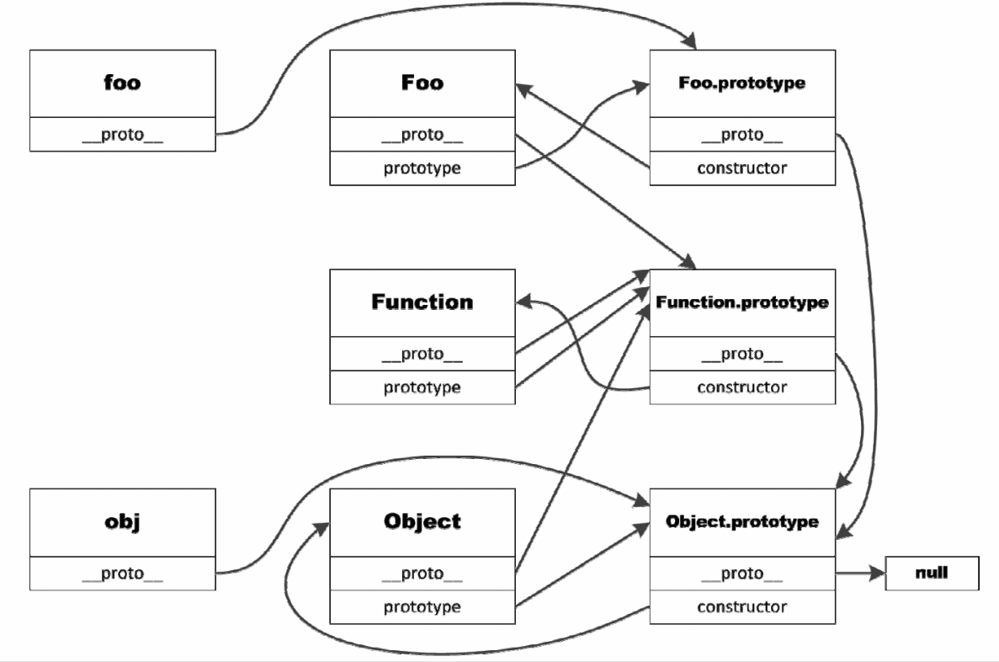

# 继承
## 原型链
每个构造函数都有一个对应的原型对象，构造函数的prototype属性指向这个对象，其实例的__proto__属性也指向这个原型对象。如果某个构造函数的原型对象正好是另一个构造函数的实例，那么就形成了一条原型链。

### 默认原型链
- js中一切皆对象，只要是数据集合就称为对象，其中有些对象可以创造新对象，有些对象只能存储数据，有些对象只执行命令。
原型链图如下：


### 原型与继承关系
1. instanceof
左边必须是对象，检测右侧原型对象是否在左侧实例的原型链上。
```js
Function instanceof Object // true
```
2. isPrototypeOf
任意一个原型对象都可以调用，判断调用该方法的原型对象是否在传入实例对象的原型链上。
```js
Object.prototype.isPrototypeOf(Function) // true
```
3. 子类覆盖或新增父类的方法需要在原型赋值后
```js
function SuperType() {
 this.property = true;
}
SuperType.prototype.getSuperValue = function() {
 return this.property;
};
function SubType() {
 this.subproperty = false;
}
// 继承 SuperType
SubType.prototype = new SuperType();
// 新方法
SubType.prototype.getSubValue = function () {
 return this.subproperty;
};
// 覆盖已有的方法
SubType.prototype.getSuperValue = function () {
 return false;
}; 
let instance = new SubType();
console.log(instance.getSuperValue()); // false 
```
### 原型链的问题
- 子类的原型在被父类实例化时，会使父类上定义的实例属性变成原型属性
-  子类型在被实例化时不能给父类型的构造函数传参，原因是可能会影响父类的实例对象(无法理解，后续跟进)。
## 盗用构造函数
在子类中调用父类构造函数，并将子类的this传递给父类，让父类在子类中被执行，该方法的缺点是子类的实例无法访问父类的方法和子类函数复用性很差。
```js
function SuperType(name){
 this.name = name;
}
function SubType() {
 // 继承 SuperType 并传参
 SuperType.call(this, "Nicholas");
 // 实例属性
 this.age = 29;
}
let instance = new SubType();
console.log(instance.name); // "Nicholas";
console.log(instance.age); // 29 
```
## 组合继承
组合继承即将盗用构造函数和原型链继承进行结合
```js
function SuperType(name){
 this.name = name;
 this.colors = ["red", "blue", "green"];
}
SuperType.prototype.sayName = function() {
 console.log(this.name);
};
function SubType(name, age){
 // 继承属性
 SuperType.call(this, name);
 this.age = age;
}
// 继承方法
SubType.prototype = new SuperType();
SubType.prototype.sayAge = function() {
 console.log(this.age);
};
let instance1 = new SubType("Nicholas", 29);
instance1.colors.push("black");
console.log(instance1.colors); // "red,blue,green,black"
instance1.sayName(); // "Nicholas";
instance1.sayAge(); // 29
let instance2 = new SubType("Greg", 27);
console.log(instance2.colors); // "red,blue,green"
instance2.sayName(); // "Greg";
instance2.sayAge(); // 27 
```
## 原型式继承
该继承方式是将多个对象需要共享的数据存在原型对象上。核心方法如下
```js
function object(o) {
 function F() {}
 F.prototype = o;
 return new F();
 let person = {
 name: "Nicholas",
 friends: ["Shelby", "Court", "Van"]
};
let anotherPerson = object(person);
anotherPerson.name = "Greg";
anotherPerson.friends.push("Rob");
let yetAnotherPerson = object(person);
yetAnotherPerson.name = "Linda";
yetAnotherPerson.friends.push("Barbie");
console.log(person.friends); // "Shelby,Court,Van,Rob,Barbie"
} 
```
后面为了规范这种写法新增了一个方法Object.create，用于实现这种原型式继承，第一个参数代表原型对象，第二个参数可以覆盖原型对象的属性值。
```js
let person = {
 name: "Nicholas",
 friends: ["Shelby", "Court", "Van"]
};
let anotherPerson = Object.create(person, {
 name: {
 value: "Greg"
 }
});
console.log(anotherPerson.name); // "Greg" 
```
## 寄生式继承
该继承方式与原型式继承的区别是将基准原型对象的相似的拓展进行封装。
```js
function createAnother(original){
 let clone = object(original); // 通过调用函数创建一个新对象
 clone.sayHi = function() { // 以某种方式增强这个对象
 console.log("hi");
 };
 return clone; // 返回这个对象
} 
```
## 寄生式组合继承
组合式继承会调用两次父类，并且会让子欸的原型上也拥有父类中定义的属性，而寄生式继承正好可以解决这个问题，让子类的原型有父类的原型继承而来。
```js
function inheritPrototype(subType, superType) {
 let prototype = object(superType.prototype); // 使用原型式继承创建对象。
 prototype.constructor = subType; // 增强对象
 subType.prototype = prototype; // 赋值对象
} 
function SuperType(name){
 this.name = name;
 this.colors = ["red", "blue", "green"];
}
SuperType.prototype.sayName = function() {
 console.log(this.name);
};
function SubType(name, age){
 // 继承属性
 SuperType.call(this, name);
 this.age = age;
}
// 继承方法
inheritPrototype(SubType,SuberType);
SubType.prototype.sayAge = function() {
 console.log(this.age);
};
```

