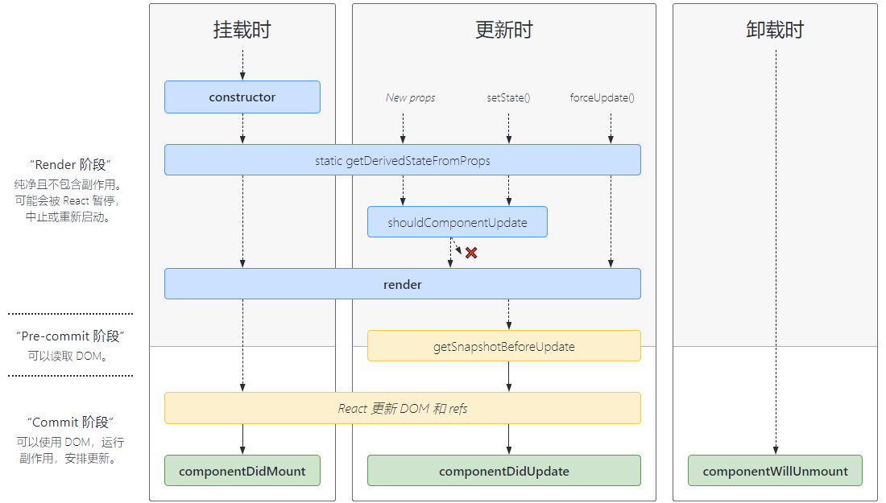

# React知识点
## 元素渲染
```js
const root = ReactDOM.createRoot(
  document.getElementById('root')
);
const element = <h1>Hello, world</h1>;
root.render(element);
// 或者如下的方式
ReactDOM.render(<App />,document.getElementById('react_root'))
```
## 组件和Props
### 类组件
类组件通过生命周期函数编写逻辑，和es6的class一样，如果派生类显示拥有构造函数，那么需要使用super进行调用父类的构造函数。
```js
class Clock extends React.Component {
  constructor(props) {
    super(props);
    this.state = {date: new Date()};
  }
  componentDidMount() {
    this.timerID = setInterval(
      () => this.tick(),
      1000
    );
  }
  componentWillUnmount() {
    clearInterval(this.timerID);
  }
  tick() {
    this.setState({
      date: new Date()
    });
  }
  render() {
    return (
      <div>
        <h1>Hello, world!</h1>
        <h2>It is {this.state.date.toLocaleTimeString()}.</h2>
      </div>
    );
  }
}
const root = ReactDOM.createRoot(document.getElementById('root'));
root.render(<Clock />);
```
### this.setState的使用
当参数为对象时，更改state对应属性的值。
```js
this.setState({
  counter: this.state.counter + this.props.increment,
});
```
当参数是函数时，函数的参数是上一次的state和此次更新的props
```js
this.setState((state, props) => ({
  counter: state.counter + props.increment
}));
```
第二个参数是一个回调函数，当组件更新完成后会调用该函数，一般建议用componentDidUpdate替代。
在类组件中处理事件时，需要绑定this，有两种方法，一种是在构造函数中进行this绑定，一种是使用箭头函数this不变的特性。
```js
class LoggingButton extends React.Component {
 constructor(props) {
    super(props);
    this.state = {isToggleOn: true};
    // 第一种，进行this绑定
    this.handleClick = this.handleClick.bind(this);
  }
  handleClick() {
    console.log('this is:', this);
  }
  render() {
    // 第二种利用箭头函数。
    return (
      // <button onClick={() => this.handleClick()}>
      //   Click me
      // </button>
      <></>
    );
  }
}
```
### 函数组件
```js
function Welcome(props) {
  return <h1>Hello, {props.name}</h1>;
}
```
## 列表和key
react支持使用map函数来生成多个相同的组件，但是需要给每个组件传递key属性，这个key属性只存在react内部，不会被组件传递。
```js
function NumberList(props) {
  const numbers = props.numbers;
  const listItems = numbers.map((number) =>
    <ListItem key={number.toString()}
              value={number} />
  );
  return (
    <ul>
      {listItems}
    </ul>
  );
}
```
## 表单
当表单组件的value值与react的state值绑定时，称该组件为受控组件。
## 状态提升
两个组件如果有公共数据源，那么应该将该数据定义在两者的父级作用域。
## 组合
对一些容器型组件来说，不确定将渲染什么内容，那么在设计该组件时，可以在使用该组件时通过props传递，默认会有children属性。在组件内部直接渲染children或相关props。
```js
function SplitPane(props) {
  return (
    <div className="SplitPane">
      <div className="SplitPane-left">
        {props.left}
      </div>
      <div className="SplitPane-right">
        {props.right}
      </div>
    </div>
  );
}
function App() {
  return (
    <SplitPane
      left={
        <Contacts />
      }
      right={
        <Chat />
      } />
  );
}
```
## Fragments
react只允许组件拥有一个根节点，所以当我们有多个元素确不想增加一个多余的根节点时，我们可以使用Fragments组件，它代表一个空节点。
```js
render() {
  return (
    <React.Fragment>
      <ChildA />
      <ChildB />
      <ChildC />
    </React.Fragment>
  );
}
```
如果不需要给Fragment传参，那么可以使用简写形式：<></>
## forwardRef
用此函数生成的组件可以显示的接收prop传递的ref属性。
```js
const Child = forwardRef((props: any, ref: any) => {
  return (
    <div>
      <button ref={ref}>点我</button>
    </div>
  );
});
function App() {
  const child = useRef<any>();
  useEffect(() => {
    setTimeout(() => {
      console.log(child);
    }, 2000);
  }, []);
  return (
    <div styleName="container">
      <Child ref={child} />
    </div>
  );
}
```
### 封装场景组件即高阶组件(HOC)的应用
当一个公共基础组件时，不想其所有方法都可以被父组件调用时，可以通过再封装，将需要用到的方法封装再新组件中
```js
import React, { useImperativeHandle, useRef } from 'react';
function buttonDecorator(Component: any) {
  const WrappedComponent: React.FC<any> = (props) => {
    const childRef = useRef<any>();
    const { parentRef, ...rest } = props;
    // 封装供外部主动调用的接口
    useImperativeHandle(parentRef, () => ({
      toggleStatus: () => {
        childRef.current.onToggleStatus();
      },
      getStatus: () => {
        return childRef?.current?.state?.status;
      },
    }));
    return <Component {...rest} ref={childRef} />;
  };
  return React.forwardRef<any, any>((props, ref) => {
    return <WrappedComponent {...props} parentRef={ref} />;
  });
}
export default buttonDecorator;
```
## React.lazy
可以懒加载组件，当组件第一次被加载时才会引入该组件的包，提高首屏加载效率等。
```js
const OtherComponent = React.lazy(() => import('./OtherComponent'));
function MyComponent() {
  return (
    <div>
      <Suspense fallback={<div>Loading...</div>}>
        <OtherComponent />
      </Suspense>
    </div>
  );
}
```
lazy现在只支持默认导出，及组件必须是被默认导出的，如果有多个模块的应该，需要定义一个默认导出的中间模块。
## React.Context
可以让其包裹的组件实现数据共享。
```js
// Context 可以让我们无须明确地传遍每一个组件，就能将值深入传递进组件树。
// 为当前的 theme 创建一个 context（“light”为默认值）。
const ThemeContext = React.createContext('light');
class App extends React.Component {
  render() {
    // 使用一个 Provider 来将当前的 theme 传递给以下的组件树。
    // 无论多深，任何组件都能读取这个值。
    // 在这个例子中，我们将 “dark” 作为当前的值传递下去。
    return (
      <ThemeContext.Provider value="dark">
        <Toolbar />
      </ThemeContext.Provider>
    );
  }
}
// 中间的组件再也不必指明往下传递 theme 了。
function Toolbar() {
  return (
    <div>
      <ThemedButton />
    </div>
  );
}
class ThemedButton extends React.Component {
  // 指定 contextType 读取当前的 theme context。
  // React 会往上找到最近的 theme Provider，然后使用它的值。
  // 在这个例子中，当前的 theme 值为 “dark”。
  static contextType = ThemeContext;
  render() {
    return <Button theme={this.context} />;
  }
}
```
### React.createContext
创建一个 Context 对象。当 React 渲染一个订阅了这个 Context 对象的组件，这个组件会从组件树中离自身最近的那个匹配的 Provider 中读取到当前的 context 值。
只有当组件所处的树中没有匹配到 Provider 时，其 defaultValue 参数才会生效。此默认值有助于在不使用 Provider 包装组件的情况下对组件进行测试。注意：将 undefined 传递给 Provider 的 value 时，消费组件的 defaultValue 不会生效。
```js
const MyContext = React.createContext(defaultValue);
```
### Context.Provider
每个 Context 对象都会返回一个 Provider React 组件，它允许消费组件订阅 context 的变化。

Provider 接收一个 value 属性，传递给消费组件。一个 Provider 可以和多个消费组件有对应关系。多个 Provider 也可以嵌套使用，里层的会覆盖外层的数据。

当 Provider 的 value 值发生变化时，它内部的所有消费组件都会重新渲染。从 Provider 到其内部 consumer 组件（包括 .contextType 和 useContext）的传播不受制于 shouldComponentUpdate 函数，因此当 consumer 组件在其祖先组件跳过更新的情况下也能更新。

通过新旧值检测来确定变化，使用了与 Object.is 相同的算法。
### Class.contextType
挂载在 class 上的 contextType 属性可以赋值为由 React.createContext() 创建的 Context 对象。此属性可以让你使用 this.context 来获取最近 Context 上的值。你可以在任何生命周期中访问到它，包括 render 函数中。
```js
class MyClass extends React.Component {
  static contextType = MyContext;
  render() {
    let value = this.context;
    /* 基于这个值进行渲染工作 */
  }
}
// 或者在接下的的手动对这个属性赋值。
MyClass.contextType = MyContext
```
### Context.Consumer
一个 React 组件可以订阅 context 的变更，此组件可以让你在函数式组件中可以订阅 context。

这种方法需要一个函数作为子元素（function as a child）。这个函数接收当前的 context 值，并返回一个 React 节点。传递给函数的 value 值等价于组件树上方离这个 context 最近的 Provider 提供的 value 值。如果没有对应的 Provider，value 参数等同于传递给 createContext() 的 defaultValue。
```js
<MyContext.Consumer>
  {value => /* 基于 context 值进行渲染*/}
</MyContext.Consumer>
```
### Context.displayName
context 对象接受一个名为 displayName 的 property，类型为字符串。React DevTools 使用该字符串来确定 context 要显示的内容。

示例，下述组件在 DevTools 中将显示为 MyDisplayName：
```js
const MyContext = React.createContext(/* some value */);
MyContext.displayName = 'MyDisplayName';
<MyContext.Provider> // "MyDisplayName.Provider" 在 DevTools 中
<MyContext.Consumer> // "MyDisplayName.Consumer" 在 DevTools 中
```
### 消费多个Context
```js
// Theme context，默认的 theme 是 “light” 值
const ThemeContext = React.createContext('light');
// 用户登录 context
const UserContext = React.createContext({
  name: 'Guest',
});
class App extends React.Component {
  render() {
    const {signedInUser, theme} = this.props;
    // 提供初始 context 值的 App 组件
    return (
      <ThemeContext.Provider value={theme}>
        <UserContext.Provider value={signedInUser}>
          <Layout />
        </UserContext.Provider>
      </ThemeContext.Provider>
    );
  }
}
function Layout() {
  return (
    <div>
      <Sidebar />
      <Content />
    </div>
  );
}
// 一个组件可能会消费多个 context
function Content() {
  return (
    <ThemeContext.Consumer>
      {theme => (
        <UserContext.Consumer>
          {user => (
            <ProfilePage user={user} theme={theme} />
          )}
        </UserContext.Consumer>
      )}
    </ThemeContext.Consumer>
  );
}
```
### 避免无用的渲染
因为 context 会根据引用标识来决定何时进行渲染（本质上是 value 属性值的浅比较），所以这里可能存在一些陷阱，当 provider 的父组件进行重渲染时，可能会在 consumers 组件中触发意外的渲染。
```js
class App extends React.Component {
  render() {
    return (
    // 一下的value值每次渲染的时候value会得到新的引用地址 ，所以导致其包裹的consumers组件被被渲染。避免这样写。
      <MyContext.Provider value={{something: 'something'}}>
        <Toolbar />
      </MyContext.Provider>
    );
  }
}
```
## 错误边界(Error Boundaries)
错误边界是一种 React 组件，这种组件可以捕获发生在其子组件树任何位置的 JavaScript 错误，并打印这些错误，同时展示降级 UI，而并不会渲染那些发生崩溃的子组件树。错误边界可以捕获发生在整个子组件树的渲染期间、生命周期方法以及构造函数中的错误。

如果一个 class 组件中定义了 static getDerivedStateFromError() 或 componentDidCatch() 这两个生命周期方法中的任意一个（或两个）时，那么它就变成一个错误边界。当抛出错误后，请使用 static getDerivedStateFromError() 渲染备用 UI ，使用 componentDidCatch() 打印错误信息。

只有class组件才能成为错误边界组件。
```js
class ErrorBoundary extends React.Component {
  constructor(props) {
    super(props);
    this.state = { hasError: false };
  }
  static getDerivedStateFromError(error) {
    // 更新 state 使下一次渲染能够显示降级后的 UI
    return { hasError: true };
  }
  componentDidCatch(error, errorInfo) {
    // 你同样可以将错误日志上报给服务器
    logErrorToMyService(error, errorInfo);
  }
  render() {
    if (this.state.hasError) {
      // 你可以自定义降级后的 UI 并渲染
      return <h1>Something went wrong.</h1>;
    }
    return this.props.children;
  }
}

<ErrorBoundary>
  <MyWidget />
</ErrorBoundary>
```

错误边界无法捕获如下错误
- 事件处理（了解更多）
- 异步代码（例如 setTimeout 或 requestAnimationFrame 回调函数）
- 服务端渲染
- 它自身抛出来的错误（并非它的子组件
## 高阶组件(HOC)
当不同的组件拥有一样的行为时，我们应该将该行为抽象成函数，通过该函数返回一个新的组件，并确保不修改原有组件。
```js
// 此函数接收一个组件...
function withSubscription(WrappedComponent, selectData) {
  // ...并返回另一个组件...
  return class extends React.Component {
    constructor(props) {
      super(props);
      this.handleChange = this.handleChange.bind(this);
      this.state = {
        data: selectData(DataSource, props)
      };
    }
    componentDidMount() {
      // ...负责订阅相关的操作...
      DataSource.addChangeListener(this.handleChange);
    }
    componentWillUnmount() {
      DataSource.removeChangeListener(this.handleChange);
    }
    handleChange() {
      this.setState({
        data: selectData(DataSource, this.props)
      });
    }
    render() {
      // ... 并使用新数据渲染被包装的组件!
      // 请注意，我们可能还会传递其他属性
      return <WrappedComponent data={this.state.data} {...this.props} />;
    }
  };
}
```
HOC应该透传与HOC无关的props，并不透传hoc相关的props。
```js
render() {
  // 过滤掉非此 HOC 额外的 props，且不要进行透传
  const { extraProp, ...passThroughProps } = this.props;
  // 将 props 注入到被包装的组件中。
  // 通常为 state 的值或者实例方法。
  const injectedProp = someStateOrInstanceMethod;
  // 将 props 传递给被包装组件
  return (
    <WrappedComponent
      injectedProp={injectedProp}
      {...passThroughProps}
    />
  );
}
```
不在render中使用hoc，因为这样每次render会生成新组件，那么之前组件的一些状态无法被保留，如果需要动态调用hoc，应该将其放入生命周期函数。
如果被包裹组件有静态方法，那么我们需要手动将这些方法进行复制，否则新组件无法获取这些方法
```js
function enhance(WrappedComponent) {
  class Enhance extends React.Component {/*...*/}
  // 必须准确知道应该拷贝哪些方法 :(
  Enhance.staticMethod = WrappedComponent.staticMethod;
  // 或则通过hoist-non-react-statics自动拷贝所有非React静态方法。
  // hoistNonReactStatic(Enhance, WrappedComponent);
  return Enhance;
```
## 与第三方库协同
有时，我们需要用到其它库来实现效果，我们可以将这些三方库与react进行集成，react只负责挂载，将dom交给三方库，又三方库进行管理。例如实现jQuery的Chosen插件。
```js
class Chosen extends React.Component {
  componentDidMount() {
    this.$el = $(this.el);
    
    this.$el.chosen({...this.props});
    this.handleChange = this.handleChange.bind(this);
    // 确保每次绑定的函数是一样的。
    this.$el.on('change', this.handleChange);
  }
  componentDidUpdate(prevProps) {
    if (prevProps.children !== this.props.children) {
      this.$el.trigger("chosen:updated");
    }
  }
  componentWillUnmount() {
    this.$el.off('change', this.handleChange);
    this.$el.chosen('destroy');
  }
  handleChange(e) {
    this.props.onChange(e.target.value);
  }
  render() {
    return (
      <div>
        <select className="Chosen-select" ref={el => this.el = el}>
          {this.props.children}
        </select>
      </div>
    );
  }
}
```
## JSX
jsx只是React.createElement方法的一个语法糖，最终调用的都是createElement方法，所以在每一个模块内都需要引入react进行编译。必须使用大写字母开头。
```js
<MyButton color="blue" shadowSize={2}>
  Click Me
</MyButton>
// 会编译为
React.createElement(
  MyButton,
  {color: 'blue', shadowSize: 2},
  'Click Me'
)
```
jsx支持使用属性来表示,当组件数量过多时很有用
```js
import React from 'react';
const MyComponents = {
  DatePicker: function DatePicker(props) {
    return <div>Imagine a {props.color} datepicker here.</div>;
  }
}
function BlueDatePicker() {
  return <MyComponents.DatePicker color="blue" />;
}
```
jsx不能是一个表达式
```js
import React from 'react';
import { PhotoStory, VideoStory } from './stories';
const components = {
  photo: PhotoStory,
  video: VideoStory
};
function Story(props) {
  // 正确！JSX 类型可以是大写字母开头的变量。
  const SpecificStory = components[props.storyType];
  return <SpecificStory story={props.story} />;
  // 错误！JSX 类型不能是一个表达式。
  // return <components[props.storyType] story={props.story} />;
}
```
jsx中的props可以接受一个js表达式，由于if和for循环不是一个表达式，所以不能作为props
```js
<MyComponent foo={1 + 2 + 3 + 4} />
```
jsx的props默认为true，并不建议不给props初始值，容易和es6对象简写混淆，这个功能只是为了保持与html标签一致。
```js
<MyTextBox autocomplete />
<MyTextBox autocomplete={true} />
// 这两个写法的效果式一致的。
```
jsx可以使用书信展开
```js
const Button = props => {
  const { kind, ...other } = props;
  const className = kind === "primary" ? "PrimaryButton" : "SecondaryButton";
  return <button className={className} {...other} />;
};
```
jsx子元素会以children属性向下传递。可以返回数组中的元素，这也是能使用map生成多个子项的原因。
```js
render() {
  // 不需要用额外的元素包裹列表元素！
  return [
    // 不要忘记设置 key :)
    <li key="A">First item</li>,
    <li key="B">Second item</li>,
    <li key="C">Third item</li>,
  ];
}
// 也可以使用函数作为子元素// 调用子元素回调 numTimes 次，来重复生成组件
function Repeat(props) {
  let items = [];
  for (let i = 0; i < props.numTimes; i++) {
    items.push(props.children(i));
  }
  return <div>{items}</div>;
}
function ListOfTenThings() {
  return (
    <Repeat numTimes={10}>
      {(index) => <div key={index}>This is item {index} in the list</div>}
    </Repeat>
  );
}
```
布尔类型、Null 以及 Undefined 将会被jsx的子元素忽略，以下渲染的结果一致。如果想要渲染这些值，需要将其转化为字符串。
```js
<div />
<div></div>
<div>{false}</div>
<div>{null}</div>
<div>{undefined}</div>
<div>{true}</div>
```
注意数字0等会被渲染,一下代码在length等于0时，会渲染处‘0’
```js
<div>
  {props.messages.length > 0 &&
    <MessageList messages={props.messages} />
  }
</div>
```
## 性能优化
### 使用生产版本
#### Create React App
只需要执行 build 命令即可
#### 单文件构建
引用对应的生产文件即可
```js
<script src="https://unpkg.com/react@18/umd/react.production.min.js"></script>
<script src="https://unpkg.com/react-dom@18/umd/react-dom.production.min.js"></script>
```
#### Brunch
通过安装 terser-brunch 插件，来获得最高效的 Brunch 生产构建
```js
# 如果你使用 npm
npm install --save-dev terser-brunch
# 如果你使用 Yarn
yarn add --dev terser-brunch
// 然后执行如下命令
brunch build -p
```
#### Browserify
需要先安装一些插件，必须按照一下顺序安装。
```js
# 如果你使用 npm
npm install --save-dev envify terser uglifyify
# 如果你使用 Yarn
yarn add --dev envify terser uglifyify
```
- envify 转换器用于设置正确的环境变量。设置为全局 (-g)。
- uglifyify 转换器移除开发相关的引用代码。同样设置为全局 (-g)。
- 最后，将产物传给 terser 并进行压缩（为什么要这么做？）。
#### Rollup
按顺序安装如下插件。
```js
# 如果你使用 npm
npm install --save-dev rollup-plugin-commonjs rollup-plugin-replace rollup-plugin-terser
# 如果你使用 Yarn
yarn add --dev rollup-plugin-commonjs rollup-plugin-replace rollup-plugin-terser
```
- replace 插件确保环境被正确设置。
- commonjs 插件用于支持 CommonJS。
- terser 插件用于压缩并生成最终的产物。
### 虚拟化长列表
即滚动条的实现(待研究),参考有react-window 和 react-virtualized
### shouldComponentUpdate
如果我们确定组件何时不需要更新，我们可以通过shouldComponentUpdate让组件不更新，当该生命周期函数返回false时，该组件不会更新
```js
class CounterButton extends React.Component {
  constructor(props) {
    super(props);
    this.state = {count: 1};
  }
  shouldComponentUpdate(nextProps, nextState) {
    if (this.props.color !== nextProps.color) {
      return true;
    }
    if (this.state.count !== nextState.count) {
      return true;
    }
    return false;
  }
  render() {
    return (
      <button
        color={this.props.color}
        onClick={() => this.setState(state => ({count: state.count + 1}))}>
        Count: {this.state.count}
      </button>
    );
  }
}
```
这个技巧被React.PurComponent集成了,但是React.PurComponent只能进行浅比较，当数据是引用类型时，会出错，这时需要手动写shouldComponentUpdate将其覆盖掉，或者在改变数据时每次返回一个新的引用值。
## Portals
Portal 提供了一种将子节点渲染到存在于父组件以外的 DOM 节点的优秀的方案
```js
ReactDOM.createPortal(child, container)
//第一个参数（child）是任何可渲染的 React 子元素，例如一个元素，字符串或 fragment。第二个参数（container）是一个 DOM 元素。
```
由此，可以使该组件的事件冒泡到真实dom树上的祖先元素，也能冒泡到react树的祖先组件中。这是由于react将事件全部代码到了最顶层。
```js
// 在 DOM 中有两个容器是兄弟级 （siblings）
const appRoot = document.getElementById('app-root');
const modalRoot = document.getElementById('modal-root');

class Modal extends React.Component {
  constructor(props) {
    super(props);
    this.el = document.createElement('div');
  }
  componentDidMount() {
    // 在 Modal 的所有子元素被挂载后，
    // 这个 portal 元素会被嵌入到 DOM 树中，
    // 这意味着子元素将被挂载到一个分离的 DOM 节点中。
    // 如果要求子组件在挂载时可以立刻接入 DOM 树，
    // 例如衡量一个 DOM 节点，
    // 或者在后代节点中使用 ‘autoFocus’，
    // 则需添加 state 到 Modal 中，
    // 仅当 Modal 被插入 DOM 树中才能渲染子元素。
    modalRoot.appendChild(this.el);
  }
  componentWillUnmount() {
    modalRoot.removeChild(this.el);
  }
  render() {
    return ReactDOM.createPortal(
      this.props.children,
      this.el
    );
  }
}
class Parent extends React.Component {
  constructor(props) {
    super(props);
    this.state = {clicks: 0};
    this.handleClick = this.handleClick.bind(this);
  }
  handleClick() {
    // 当子元素里的按钮被点击时，
    // 这个将会被触发更新父元素的 state，
    // 即使这个按钮在 DOM 中不是直接关联的后代
    this.setState(state => ({
      clicks: state.clicks + 1
    }));
  }
  render() {
    return (
      <div onClick={this.handleClick}>
        <p>Number of clicks: {this.state.clicks}</p>
        <p>
          Open up the browser DevTools
          to observe that the button
          is not a child of the div
          with the onClick handler.
        </p>
        <Modal>
          <Child />
        </Modal>
      </div>
    );
  }
}
function Child() {
  // 这个按钮的点击事件会冒泡到父元素
  // 因为这里没有定义 'onClick' 属性
  return (
    <div className="modal">
      <button>Click</button>
    </div>
  );
}
const root = ReactDOM.createRoot(appRoot);
root.render(<Parent />);
```
## Profiler
可以测量一个组件渲染的代价。用法如下
```js
render(
  <App>
    <Profiler id="Navigation" onRender={onRenderCallback}>
      <Navigation {...props} />
    </Profiler>
    <Main {...props} />
  </App>
);
//在渲染后会调用onRender，传入的参数如下。
function onRenderCallback(
  id, // 发生提交的 Profiler 树的 “id”
  phase, // "mount" （如果组件树刚加载） 或者 "update" （如果它重渲染了）之一
  actualDuration, // 本次更新 committed 花费的渲染时间
  baseDuration, // 估计不使用 memoization 的情况下渲染整棵子树需要的时间
  startTime, // 本次更新中 React 开始渲染的时间
  commitTime, // 本次更新中 React committed 的时间
  interactions // 属于本次更新的 interactions 的集合
) {
  // 合计或记录渲染时间。。。
}
```
## 不使用ES6
使用es5定义react组件需要引用模块create-react-class
```js
var SayHello = createReactClass({
  // 用class和函数组件，默认有defaultProps属性，但es5需要手动定义。
  getDefaultProps: function() {
    return {
      name: 'Mary'
    };
  },
  // 初始化state
  getInitialState: function() {
    return {message: 'Hello!'};
  },
  //自动绑定了this，不用向es6一样手动绑定this。
  handleClick: function() {
    alert(this.state.message);
  },
  render: function() {
    return (
      <button onClick={this.handleClick}>
        Say hello
      </button>
    );
  }
});
```
## 不使用jsx
jsx是React.createElement的语法糖，任意jsx可以使用React.createElement进行代替编写。
## diffing算法
比较一颗树后生成另一个树的复杂度为O(n³)，此复杂度实在太过高，由此，react假设了两种情况
1. 两个不同类型的元素会产生出不同的树；
2. 开发者可以使用 key 属性标识哪些子元素在不同的渲染中可能是不变的。

这样可以将复杂度降为O(n)
而对比过程大致可分为一下几种。
### 对比不同类型的元素
react会从根元素开始对比不同类型的元素，如果根元素的类型发生了变化，那么会卸载整颗树并渲染新的树。
### 对比同类型的元素
如果两个元素类型相同，react会对比元素的属性，修改这些属性。不会重新构建这个元素。
### 对子节点递归
当对子节点进行比较时，如果在列表中的首行插入一个节点，那么react并不会知道以前的节点也可以使用，由此react设计了key，可以通过key来判断哪些节点可以直接移动。
### keys
key在列表类不可重复，并且建议不用不稳定的值，例如Math.random()产生的值。
## Refs
Refs使用场景有
- 管理焦点，文本选择或媒体播放。
- 触发强制动画。
- 集成第三方 DOM 库

### 访问Refs
当 ref 被传递给 render 中的元素时，对该节点的引用可以在 ref 的 current 属性中被访问。
```js
const node = this.myRef.current;
```
ref 的值根据节点的类型而有所不同：
- 当 ref 属性用于 HTML 元素时，构造函数中使用 React.createRef() 创建的 ref 接收底层 DOM 元素作为其 current 属性。
- 当 ref 属性用于自定义 class 组件时，ref 对象接收组件的挂载实例作为其 current 属性。
- 你不能在函数组件上使用 ref 属性，因为他们没有实例，如果需要使用，那么可以通过forwardRef转发

由此我们可以通过ref访问类组件实例的方法。
```js
class CustomTextInput extends React.Component {
  constructor(props) {
    super(props);
    // 创建一个 ref 来存储 textInput 的 DOM 元素
    this.textInput = React.createRef();
    this.focusTextInput = this.focusTextInput.bind(this);
  }
  focusTextInput() {
    // 直接使用原生 API 使 text 输入框获得焦点
    // 注意：我们通过 "current" 来访问 DOM 节点
    this.textInput.current.focus();
  }
  render() {
    // 告诉 React 我们想把 <input> ref 关联到
    // 构造器里创建的 `textInput` 上
    return (
      <div>
        <input
          type="text"
          ref={this.textInput} />
        <input
          type="button"
          value="Focus the text input"
          onClick={this.focusTextInput}
        />
      </div>
    );
  }
}
class AutoFocusTextInput extends React.Component {
  constructor(props) {
    super(props);
    this.textInput = React.createRef();
  }
  componentDidMount() {
    this.textInput.current.focusTextInput();
  }
  render() {
    return (
      <CustomTextInput ref={this.textInput} />
    );
  }
}
```
### 回调Refs
ref的值可以接受一个函数，该函数被执行时，会将dom对象传入该函数，由此我们可以将dom赋值给我们想赋值的对象。
```js
function CustomTextInput(props) {
  return (
    <div>
      <input ref={props.inputRef} />
    </div>
  );
}
class Parent extends React.Component {
  render() {
    return (
      <CustomTextInput
        inputRef={el => this.inputElement = el}
      />
    );
  }
}
```
## render Props
具有 render prop 的组件接受一个返回 React 元素的函数，并在组件内部通过调用此函数来实现自己的渲染逻辑。
```js
class Cat extends React.Component {
  render() {
    const mouse = this.props.mouse;
    return (
      
    );
  }
}
class Mouse extends React.Component {
  constructor(props) {
    super(props);
    this.handleMouseMove = this.handleMouseMove.bind(this);
    this.state = { x: 0, y: 0 };
  }
  handleMouseMove(event) {
    this.setState({
      x: event.clientX,
      y: event.clientY
    });
  }
  render() {
    return (
      <div style={{ height: '100vh' }} onMouseMove={this.handleMouseMove}>

        {/*
          使用 `render`prop 动态决定要渲染的内容，
          而不是给出一个 <Mouse> 渲染结果的静态表示
        */}
        {this.props.render(this.state)}
      </div>
    );
  }
}
class MouseTracker extends React.Component {
  render() {
    return (
      <div>
        <h1>移动鼠标!</h1>
        <Mouse render={mouse => (
          <Cat mouse={mouse} />
        )}/>
      </div>
    );
  }
}
```
该技术也可以通过别的方式实现，例如直接将组件的children设置为一个函数也有一样的效果。
```js
<Mouse>
  {mouse => (
    <p>鼠标的位置是 {mouse.x}，{mouse.y}</p>
  )}
</Mouse>
```
## 严格模式
StrictMode可以帮助我们显示应用程序的隐藏问题。
```js
function ExampleApplication() {
  return (
    <div>
      <Header />
      <React.StrictMode>
        <div>
          <ComponentOne />
          <ComponentTwo />
        </div>
      </React.StrictMode>
      <Footer />
    </div>
  );
}
```
目前能解决的问题有
- 识别不安全的生命周期
- 关于使用过时字符串 ref API 的警告
- 关于使用废弃的 findDOMNode 方法的警告
- 检测意外的副作用
- 检测过时的 context API
- 确保可复用的状态
## PropsTypes
使用PropsTypes可以为组件的props进行类型检查,包含的类型如下。
```js
import PropTypes from 'prop-types';

MyComponent.propTypes = {
  // 你可以将属性声明为 JS 原生类型，默认情况下
  // 这些属性都是可选的。
  optionalArray: PropTypes.array,
  optionalBool: PropTypes.bool,
  optionalFunc: PropTypes.func,
  optionalNumber: PropTypes.number,
  optionalObject: PropTypes.object,
  optionalString: PropTypes.string,
  optionalSymbol: PropTypes.symbol,

  // 任何可被渲染的元素（包括数字、字符串、元素或数组）
  // (或 Fragment) 也包含这些类型。
  optionalNode: PropTypes.node,

  // 一个 React 元素。
  optionalElement: PropTypes.element,

  // 一个 React 元素类型（即，MyComponent）。
  optionalElementType: PropTypes.elementType,

  // 你也可以声明 prop 为类的实例，这里使用
  // JS 的 instanceof 操作符。
  optionalMessage: PropTypes.instanceOf(Message),

  // 你可以让你的 prop 只能是特定的值，指定它为
  // 枚举类型。
  optionalEnum: PropTypes.oneOf(['News', 'Photos']),

  // 一个对象可以是几种类型中的任意一个类型
  optionalUnion: PropTypes.oneOfType([
    PropTypes.string,
    PropTypes.number,
    PropTypes.instanceOf(Message)
  ]),

  // 可以指定一个数组由某一类型的元素组成
  optionalArrayOf: PropTypes.arrayOf(PropTypes.number),

  // 可以指定一个对象由某一类型的值组成
  optionalObjectOf: PropTypes.objectOf(PropTypes.number),

  // 可以指定一个对象由特定的类型值组成
  optionalObjectWithShape: PropTypes.shape({
    color: PropTypes.string,
    fontSize: PropTypes.number
  }),

  // An object with warnings on extra properties
  optionalObjectWithStrictShape: PropTypes.exact({
    name: PropTypes.string,
    quantity: PropTypes.number
  }),

  // 你可以在任何 PropTypes 属性后面加上 `isRequired` ，确保
  // 这个 prop 没有被提供时，会打印警告信息。
  requiredFunc: PropTypes.func.isRequired,

  // 任意类型的必需数据
  requiredAny: PropTypes.any.isRequired,

  // 你可以指定一个自定义验证器。它在验证失败时应返回一个 Error 对象。
  // 请不要使用 `console.warn` 或抛出异常，因为这在 `oneOfType` 中不会起作用。
  customProp: function(props, propName, componentName) {
    if (!/matchme/.test(props[propName])) {
      return new Error(
        'Invalid prop `' + propName + '` supplied to' +
        ' `' + componentName + '`. Validation failed.'
      );
    }
  },

  // 你也可以提供一个自定义的 `arrayOf` 或 `objectOf` 验证器。
  // 它应该在验证失败时返回一个 Error 对象。
  // 验证器将验证数组或对象中的每个值。验证器的前两个参数
  // 第一个是数组或对象本身
  // 第二个是他们当前的键。
  customArrayProp: PropTypes.arrayOf(function(propValue, key, componentName, location, propFullName) {
    if (!/matchme/.test(propValue[key])) {
      return new Error(
        'Invalid prop `' + propFullName + '` supplied to' +
        ' `' + componentName + '`. Validation failed.'
      );
    }
  })
};
```
使用模式如下
```js
class MyComponent extends React.Component {
  render() {
    // 这必须只有一个元素，否则控制台会打印警告。
    const children = this.props.children;
    return (
      <div>
        {children}
      </div>
    );
  }
}
MyComponent.propTypes = {
  children: PropTypes.element.isRequired
};
// 函数组件类似
function HelloWorldComponent({ name }) {
  return (
    <div>Hello, {name}</div>
  )
}
HelloWorldComponent.propTypes = {
  name: PropTypes.string
}
export default HelloWorldComponent
```
## 非受控组件
表单元素value值不受组件控制，则属于非受控组件。
非受控组件一般希望拥有一个不变的默认值，react提供了defaultValue属性，当一个组件挂载之后defaultValue改变不会影响dom元素的value值。同样，复选框和单选框支持defaultChecked，下拉框和多行文本框支持defaultValue。
## webComment & React
webComment可以封装组件，能够复用，并且不会造成样式污染和变量污染。具体实现如下
```js
<script>
  class HelloHockor extends HTMLElement {
    constructor() {
      super();
      const shadow = this.attachShadow({
        mode: "open",
      });
      const div = document.createElement("div");
      div.className = "hello";
      // 不会污染外界
      const style = document.createElement("style");
      style.innerHTML = `
        .hello {
          color: red;
        }
      `;
      div.innerHTML = "hello world";
      shadow.appendChild(div);
      shadow.appendChild(style);
    }
  }
  // 作为标签的名字，名字必须有“-”
  const tagName = "hello-hockor";
  // 判断页面中是否已定义过该 tag
  const isDefined = customElements.get(tagName);
  if (!isDefined) {
    customElements.define(tagName, HelloHockor);
  }
</script>
```
和React结合使用
```js
class XSearch extends HTMLElement {
  connectedCallback() {
    const mountPoint = document.createElement('span');
    this.attachShadow({ mode: 'open' }).appendChild(mountPoint);
    const name = this.getAttribute('name');
    const url = 'https://www.google.com/search?q=' + encodeURIComponent(name);
    const root = ReactDOM.createRoot(mountPoint);
    root.render(<a href={url}>{name}</a>);
  }
}
customElements.define('x-search', XSearch);
```
## React顶层api
### React.memo
被React.memo包裹的组件如果props没有改变，那么渲染是会自动复用上一次渲染的结果，如果内部有state或context之变化也会重新渲染。和React.PureComponent一样，只做浅层比较。
```js
function MyComponent(props) {
  /* 使用 props 渲染 */
}
// 该函数可以让我们手动判断props是否相等。
function areEqual(prevProps, nextProps) {
  /*
  如果把 nextProps 传入 render 方法的返回结果与
  将 prevProps 传入 render 方法的返回结果一致则返回 true，
  否则返回 false,即要更新返回false，不更新返回true
  */
}
export default React.memo(MyComponent, areEqual);
```
### React.cloneElement
可以将一个React元素克隆。config参数是新的props，会将config与element的Props合并后，返回新的React元素。
```js
React.cloneElement(
  element,
  [config],
  [...children]
)
```
### React.isValidElement()
可以检验一个对象是不是React元素，是返回true，反之返回false
### React.Children
提供了处理Props中children数据的方法。只能处理children所在那一层的节点，并且Fragment也算一个元素，所以如果children是Fragment元素时只有一个节点。
```js
//在 children 里的每个直接子节点上调用一个函数，并将 this 设置为 thisArg。如果 children 是一个数组，它将被遍历并为数组中的每个子节点调用该函数。如果子节点为 null 或是 undefined，则此方法将返回 null 或是 undefined，而不会返回数组。
React.Children.map(children, function[(thisArg)])
//与 React.Children.map() 类似，但它不会返回一个数组
React.Children.forEach(children, function[(thisArg)])
//返回 children 中的组件总数量，等同于通过 map 或 forEach 调用回调函数的次数。
React.Children.count(children)
//验证 children 是否只有一个子节点（一个 React 元素），如果有则返回它，否则此方法会抛出错误。
React.Children.only(children)
//将children扁平成数组，并为每一个子节点添加一个key，默认是索引
React.Children.toArray(children)
```
## React.Component
生命周期图


### constructor()
该函数中不调用setState方法
### componentDidMount()
在组件挂载后立即调用，一般网络请求或者消息订阅等，或者一些初始化操作应该在这里执行。
### componentDidUpdate()
首次渲染不会执行该方法，会在更新后调用该方法，必须包裹在一个判断语句内，否则会出现死循环。
```js
componentDidUpdate(prevProps, prevState, snapshot)
// snapshot参数是getSnapshotBeforeUpdate钩子调用后的返回值。
```
### componentWillUnmount()
该方法内一般用作取消订阅，清除定时器等操作。不要调用setState方法。
### shouldComponentUpdate()
可以控制组件是否需要更新
```js
shouldComponentUpdate(nextProps, nextState)
```
### getDerivedStateFromProps()
会在每一次render之前进行调用，当组件需要根据props的值修改state时，调用该方法。
```js
static getDerivedStateFromProps(props, state)
```
### getSnapshotBeforeUpdate()
组件即将被插入dom树时会被调用。一般在这时获取更改前dom的一些信息。
```js
getSnapshotBeforeUpdate(prevProps, prevState)
```
### componentDidCatch()
此生命周期在后代组件抛出错误后被调用。 它接收两个参数
1. error —— 抛出的错误。
2. info —— 带有 componentStack key 的对象，其中包含有关组件引发错误的栈信息。
### forceUpdate()
该方法可以强制刷新组件的render，并且会跳过shouldComponentUpdate，但其子组件会完整执行生命周期。
## ReactDOM
包含了DOM的一些操作可以通过顶层调用
```js
import * as ReactDOM from 'react-dom';
// 如果时es5，使用require
var ReactDOM = require('react-dom');
// 同时react-dom分为了react-dom/client(客户端)和react-dom/server(服务端)
```
包含了如下方法
### createPortal()
创建portal
```js
createPortal(child, container)
```
### flushSync()
强制 React 同步刷新提供的回调函数中的任何更新。这确保了 DOM 会被立即 更新。
```js
flushSync(() => {
  setCount(count + 1);
});
```
以下是将被遗弃的方法。
### render()
将react元素插入到指定dom中，在react18中被createRoot方法替代。
```js
/**
 * @element 待插入的react元素
 * @container 容器DOM
 * @callback 每次组件渲染后的回调
*/
render(element, container[, callback])
```
### hydrate()
与reactdom/server有关。
### findDOMNode(component)
可以获取该组件对应的原生dom元素，已弃用。
### unmountComponentAtNode(container)
卸载容器内的组件,有且被卸载返回true，否则返回false，react18后被root.unmount()取代。
## ReactDOMClient
### createRoot()
与react顶层api相似，创建一个根节点，然后将组件渲染到该根节点上。
### hydrateRoot()
替换hydrate()
## ReactDOMServer
用作服务端渲染(暂时不学)
## React & DOM
jsx中的元素属性与原生dom有差别，具体如下
### checked
当input组件的 type 类型为 checkbox 或 radio 时，组件支持 checked 属性。你可以使用它来设置组件是否被选中。这对于构建受控组件（controlled components）很有帮助。而 defaultChecked 则是非受控组件的属性，用于设置组件首次挂载时是否被选中
### className
为原生DOM的class
### dangerouslySetInnerHTML
可以通过该属性为节点设置innerHtml。
```js
function createMarkup() {
  return {__html: 'First &middot; Second'};
}
function MyComponent() {
  return <div dangerouslySetInnerHTML={createMarkup()} />;
}
```
### htmlFor
由于for在JavaScript中为保留字，所以将for属性改为htmlFor
### onChange
onChange 事件与预期行为一致：每当表单字段变化时，该事件都会被触发。
### selected
如果要将option标记为已选中状态，请在 select 的 value 中引用该选项的值。
### style
采用小驼峰命名。
```js
const divStyle = {
  color: 'blue',
  backgroundImage: 'url(' + imgUrl + ')',
};
function HelloWorldComponent(){
  return <div style={divStyle}>Hello World!</div>;
}
```
React 会自动添加 ”px” 后缀到内联样式为数字的属性后。如需使用 ”px” 以外的单位，请将此值设为数字与所需单位组成的字符串。
```js
<div style={{ height: 10 }}>
  Hello World!
</div>
// Result style: '10%'
<div style={{ height: '10%' }}>
  Hello World!
</div>
```
## 合成事件
react对原生事件进行了合成，有些事件有特殊处理。
### onScroll滚动条事件
在react17后，在react中不在冒泡
### onWheel鼠标滚轮事件
## HOOK
Hook是React16.8的新增特性。它可以让你在不编写class的情况下使用state以及其他的React特性。hook再
### State Hook
一般并不建议使用多个useState，因为useState可以很好的储存数组或对象。
```js
const [count, setCount] = useState(0);
```
返回的setState函数可以可以传入函数，函数的参数是上一次的state。
```js
function Counter({initialCount}) {
  const [count, setCount] = useState(initialCount);
  return (
    <>
      Count: {count}
      <button onClick={() => setCount(initialCount)}>Reset</button>
      <button onClick={() => setCount(prevCount => prevCount - 1)}>-</button>
      <button onClick={() => setCount(prevCount => prevCount + 1)}>+</button>
    </>
  );
}
```
useState的初始值来自复杂计算时，可以传入一个函数，函数的返回值会作为初始值。
```js
const [state, setState] = useState(() => {
  const initialState = someExpensiveComputation(props);
  return initialState;
});
```
React使用了Object.is来比较state的。

### 多个state同一时间更新
当我们同步调用多个setState时，在第一个setState被调用时，react同步将该state的值进行更新，然后将更新组件的代码放入一个微任务中。所以当第一个setState执行后，不会立刻更新组件，而是会继续调用其它的setState进行状态值的修改。当组件内所有同步setState执行完后，微任务的回调执行，执行完后将该微任务的变量置空。

### Effect Hook
- 每一次渲染都会调用该hook，相当于类组件的componentDidMount，componentDidUpdate 和 componentWillUnmount 这三个函数的组合。
- 组件每次渲染的时候都会执行一遍useeffect函数，所以每次渲染都会生成一个新的effect，保证每次的变量是最新的。同时，会将上一个effect清除，清除的同时会执行useEffect返回的函数。
- 在开发模式下，且使用了严格模式，那么useeffect会加载两次，为了模拟立即卸载组件后又重新挂载组件的情形。 
```js
  useEffect(() => {
    // 使用浏览器的 API 更新页面标题
    document.title = `You clicked ${count} times`;
  });
```
可以返回一个函数处理组件卸载后需要处理的事。相当于componentWillUnmount
```js
   useEffect(() => {
    ChatAPI.subscribeToFriendStatus(props.friend.id, handleStatusChange);
    return () => {
      ChatAPI.unsubscribeFromFriendStatus(props.friend.id, handleStatusChange);
    };
  });
```
每次生成新的effect会导致性能问题或某些bug，所以我们需要控制effect的更新。通过为effect传递第二个参数来控制更新，第二个参数是一个数组，当数组内的变量改变时，才会重新更新useeffect,如果传一个。

### Hook使用规则
Hook 就是 JavaScript 函数，，但是使用它们会有两个额外的规则：
- 只能在函数最外层调用 Hook。不要在循环、条件判断或者子函数中调用。
- 只能在 React 的函数组件中调用 Hook。不要在其他 JavaScript 函数中调用，当然自定义hook中可以使用
Hook需要在组件的最顶层，组件的hook必须按照顺序执行。
Hook的名称必须以use开头。
### 自定义Hook
有时，我们希望有些组件的状态逻辑得到复用，那么我们可以将这段代码提取出来当作自定义hook，在我们的组件中使用。这部分代码其实相当于抽象函数一样，将可复用代码抽离，在组件内调用时，将这些代码在组件内执行一遍而已。譬如自定义hook里面使用的useState等hook其实相当于在组件中使用一样。
```js
import React, { useState, useEffect } from 'react';
function useFriendStatus(friendID) {
  const [isOnline, setIsOnline] = useState(null);
  function handleStatusChange(status) {
    setIsOnline(status.isOnline);
  }
  useEffect(() => {
    ChatAPI.subscribeToFriendStatus(friendID, handleStatusChange);
    return () => {
      ChatAPI.unsubscribeFromFriendStatus(friendID, handleStatusChange);
    };
  });
  return isOnline;
}
// 使用
function FriendStatus(props) {
  const isOnline = useFriendStatus(props.friend.id);
  if (isOnline === null) {
    return 'Loading...';
  }
  return isOnline ? 'Online' : 'Offline';
}
```
### 其它hook
#### useContext
订阅Context对象，返回Context对象的当前值。
```js
const ThemeContext = React.createContext();
function App() {
  return (
    <ThemeContext.Provider value={{backgroundColor:'red'}}>
      <Title />
    </ThemeContext.Provider>
  );
}
function Title() {
  const theme = React.useContext(ThemeContext);
  return (
    <p style={{ backgroundColor: theme.backgroundColor}}>
      I am styled by theme context!
    </p>
  );
}
```
### useReducer
用来替代useState，当state依赖之前的值，并对应多种返回值时，用此Hook较为方便。与redux或vuex触发数据修改的思想类似。
```js
const initialState = {count: 0};
function reducer(state, action) {
  switch (action.type) {
    case 'increment':
      return {count: state.count + 1};
    case 'decrement':
      return {count: state.count - 1};
    default:
      throw new Error();
  }
}
function Counter() {
  const [state, dispatch] = useReducer(reducer, initialState);
  return (
    <>
      Count: {state.count}
      <button onClick={() => dispatch({type: 'decrement'})}>-</button>
      <button onClick={() => dispatch({type: 'increment'})}>+</button>
    </>
  );
}
```
有时初始值来自props，需要做一些初始化处理，可以将初始化函数以第三个参数传入。init只在初始化Hook时被调用。
```js
function init(initialCount) {
  return {count: initialCount};
}
function reducer(state, action) {
  switch (action.type) {
    case 'increment':
      return {count: state.count + 1};
    case 'decrement':
      return {count: state.count - 1};
    case 'reset':
      return init(action.payload);
    default:
      throw new Error();
  }
}
function Counter({initialCount}) {
  const [state, dispatch] = useReducer(reducer, initialCount, init);
  return (
    <>
      Count: {state.count}
      <button
        onClick={() => dispatch({type: 'reset', payload: initialCount})}>
        Reset
      </button>
      <button onClick={() => dispatch({type: 'decrement'})}>-</button>
      <button onClick={() => dispatch({type: 'increment'})}>+</button>
    </>
  );
}
```
如果useReducer返回的state与上次返回的state相同，那么，该组件会跳过该次渲染和副作用的执行。
### useCallback
返回一个memoized函数,该memoized函数只会在第二个参数数组中的值变化时进行更改。如果传递空数组则只会在第一次渲染时调用useCallback
```js
const memoizedCallback = useCallback(
  () => {
    doSomething(a, b);
  },
  [a, b],
);
```
### useMemo
返回一个第一个参数函数返回的值，返回的值由自己定义，如果第二个参数的数组值为空，那么每次都会执行,主要用作计算。
```js
const memoizedValue = useMemo(() => computeExpensiveValue(a, b), [a, b]);
```
### useRef
返回一个可变的ref对象，不仅可以存储dom节点，可以用来存储其它变量。
### useImperativeHandle
可以为父组件传入的ref绑定方法。
```js
function FancyInput(props, ref) {
  const inputRef = useRef();
  useImperativeHandle(ref, () => ({
    focus: () => {
      inputRef.current.focus();
    }
  }));
  return <input ref={inputRef} {...props} />;
}
FancyInput = forwardRef(FancyInput);
```
### useLayoutEffect
其函数签名与 useEffect 相同，但它会在所有的 DOM 变更之后同步调用 effect。可以使用它来读取 DOM 布局并同步触发重渲染。在浏览器执行绘制之前，useLayoutEffect 内部的更新计划将被同步刷新。
### useDebugValue
### useDeferredValue
可以让返回的数据在下一帧或更迟的时间渲染.第二个参数可以配置延迟多久
```js
const deferredValue = useDeferredValue(value);
const [state, setState] = useDeferredValue(initialState, {
  timeoutMs: 1000, // 延迟更新时间，单位毫秒
  maximumTimeMs: 5000, // 最长延迟更新时间，单位毫秒
  equalityFn: (a, b) => a.id === b.id, // 状态相等性比较函数
});
```
### useTransition
可以让代码延迟执行
```js
const [isPending, startTransition] = useTransition();
const [input, setInput] = useState<string>("");
const [list, setList] = useState<string[]>([]);
const LIST_SIZE = 20000;

function handleChange(e: React.ChangeEvent<HTMLInputElement>) {
  setInput(e.target.value);
  // 下面的代码会在setinput更改过后进行执行
  startTransition(() => {
    const l = [];
    for (let i = 0; i < LIST_SIZE; i++) {
      l.push(e.target.value);
    }

    setList(l);
  });
}
return (
  <div>
    <input type="text" value={input} onChange={handleChange} />
    {isPending ? (
      <p>数据加载中……</p>
    ) : (
      list.map((item, index) => {
        return <div key={index}>{item}</div>;
      })
    )}
  </div>
);
```
### React.useId()
在组件内生成唯一id
## Concurrent模式
Concurrent模式可以让浏览器的渲染暂停，将快速更改的渲染放在react中，等更改暂停后，在渲染在屏幕上，让屏幕更多的停留在旧的页面，不展示哪些半成品的渲染效果。

## Suspense
用于数据获取的 Suspense 是一个新特性，你可以使用Suspense以声明的方式来“等待”任何内容，包括数据。
传统数据请求与Suspense
- Fetch-on-render（渲染之后获取数据，如：在 useEffect 中 fetch）：先开始渲染组件，每个完成渲染的组件都可能在它们的 effects 或者生命周期函数中获取数据。这种方式经常导致“瀑布”问题。
- Fetch-then-render（接收到全部数据之后渲染，如：不使用 Suspense 的 Relay）：先尽早获取下一屏需要的所有数据，数据准备好后，渲染新的屏幕。但在数据拿到之前，我们什么事也做不了。譬如组件内需要同时发起两个请求，可能其中一个请求数据已经回来了，但是我们却无法立刻进行渲染。
- Render-as-you-fetch（获取数据之后渲染，如：使用了 Suspense 的 Relay）：先尽早获取下一屏需要的所有数据，然后立刻渲染新的屏幕——在网络响应可用之前就开始。在接收到数据的过程中，React迭代地渲染需要数据的组件，直到渲染完所有内容为止。
```js
// 这不是一个 Promise。这是一个支持 Suspense 的特殊对象。
const resource = fetchProfileData();
function ProfilePage() {
  return (
    <Suspense fallback={<h1>Loading profile...</h1>}>
      <ProfileDetails />
      <Suspense fallback={<h1>Loading posts...</h1>}>
        <ProfileTimeline />
      </Suspense>
    </Suspense>
  );
}
function ProfileDetails() {
  // 尝试读取用户信息，尽管信息可能未加载完毕
  const user = resource.user.read();
  return <h1>{user.name}</h1>;
}
function ProfileTimeline() {
  // 尝试读取博文数据，尽管数据可能未加载完毕
  const posts = resource.posts.read();
  return (
    <ul>
      {posts.map(post => (
        <li key={post.id}>{post.text}</li>
      ))}
    </ul>
  );
}
``` 
## 组件更新
组件的state hook更新后，当前组件及其子节点都会更新一次。如果一次更新中同时对子元素和父元素进行了state hook更新，所有组件也只会更新一次。


