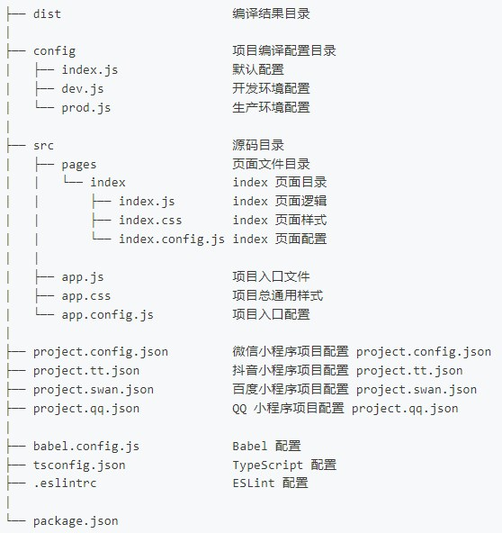

# Taro

一个打包多端小程序,H5,RN 等应用的框架

## 项目目录



## 模式和环境变量

通过执行不同的编译命令从而执行根目录下的不同的 env 文件(键值对形式的变量预设)，为当前项目创造全局变量，此方式通过此方式使前端项目具有角色分辨功能。

```js
// 获取env文件设置的全局变量
process.env.TARO_APP_API;
```

## 编译配置

config 目录下存放 taro 打包的自定义配置。

## 尺寸单位

taro 默认会将单位转换为 rpx(小程序)和(h5)，转换比例在 config 目录下配置

## 全局配置

app.config.js 文件可以对小程序进行导航栏、顶部/底部窗口背景色，页面组件导航，请求超时处理、小程序获取手机权限等配置。

## 页面配置

主要配置一些小程序的页面样式，这个配置覆盖全局配置。

## 项目配置

可以建立多个指定的配置文件，以获得在不同应用中加载不同配置文件的效果。
